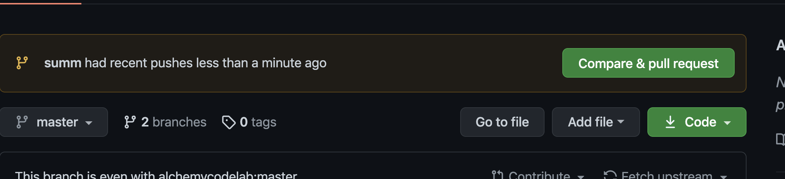
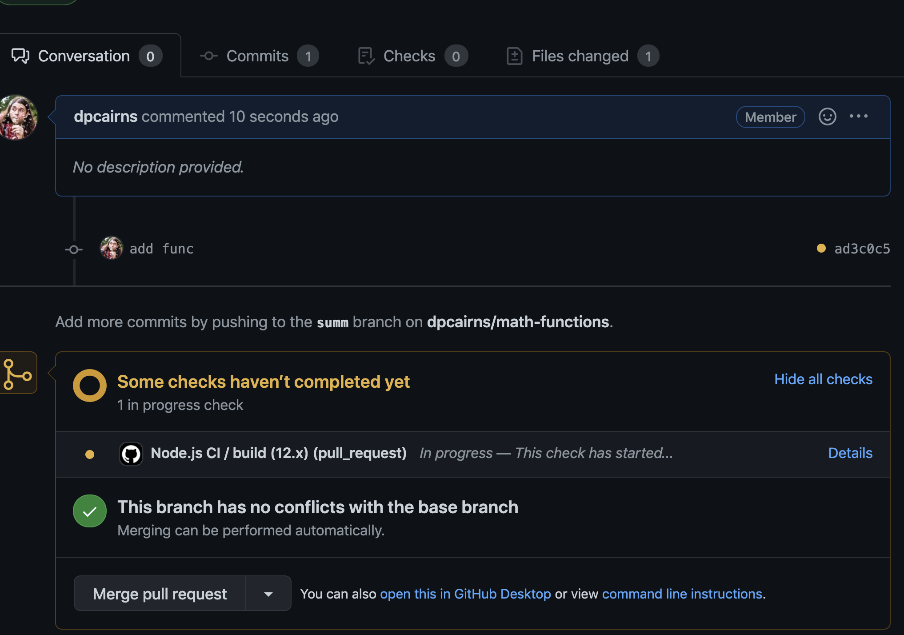

# Math Functions on Branches

## Step 1 is to fork this repo!

### Writing Code On Branches

Today in lab you will fork and clone a GitHub repo, and then create solutions to some code problems such that your solutions pass the included tests.

**Be sure to follow instructions carefully.**

Here are a couple of things to keep in mind:

* Create a new branch for each code problem, then make a PR into *master* on github. Then make sure the tests are passing. If they are, merge that branch into *master* on GitHub (and then pull back into master on your laptop!) when the problem is completed. Do the problems in order. Don't forget to pull the updated master branch from GitHub into your local master branch each time you merge a pull request, then make a new branch from master for the next problem.

Here is where the PR should show up when you `git push -u origin sum`


Here is where the tests should run when you make your PR


```bash
git checkout -b my-branch
ACP
make pull request
merge pull request
git checkout master
git pull origin master
git checkout -b my-next-branch
```

### After all PRs are merged, make sure tests pass in CI before submitting

* Although this is an individual lab assignment, do feel free to (heck, it is *encouraged* that you) collaborate and work in pairs or groups.

### Tests
You are being given starter code for today, including tests. The success of your code will be determined by whether it passes tests that are in the `math-functions.test.js` file. You should
not change anything in the test files, though you should take a look at it to see how it works.

### Submission Instructions

Make sure your *master* branch is up to date with your most recent code. Create a new pull request on GitHub from your master branch to the master branch of the alchemycodelab fork, making sure that the left dropdown `base repository` says `alchemycodelab/math-functions` and the right dropdown `head repository` says `<your github username>/math-functions`

Make sure your PR passes CI!

